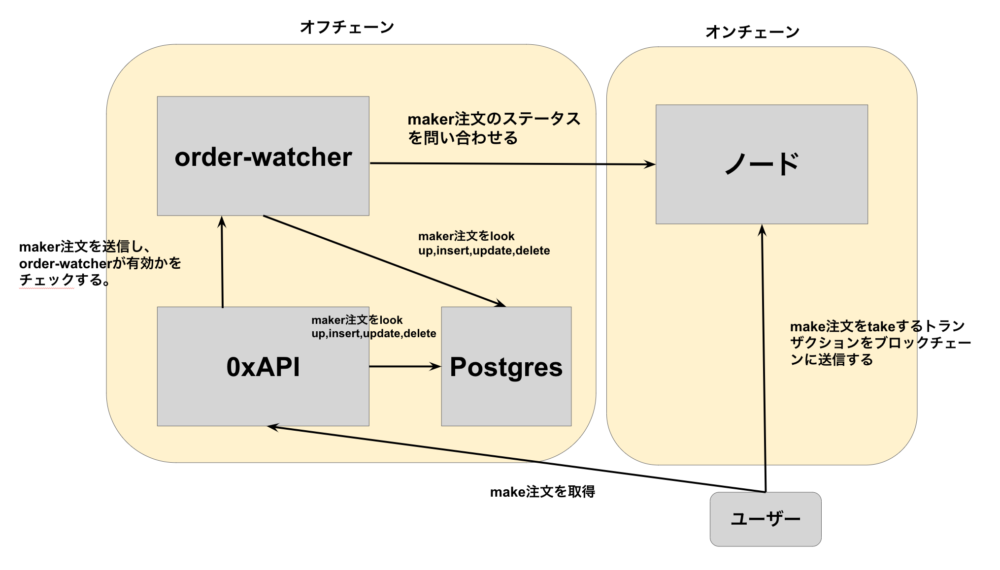
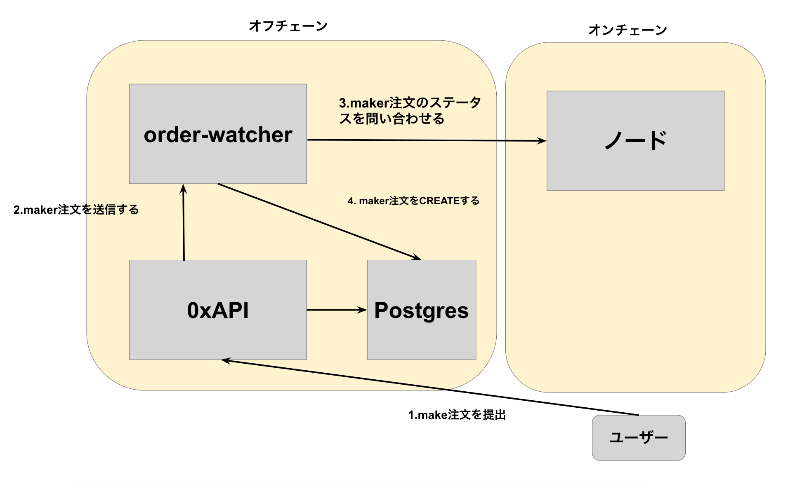
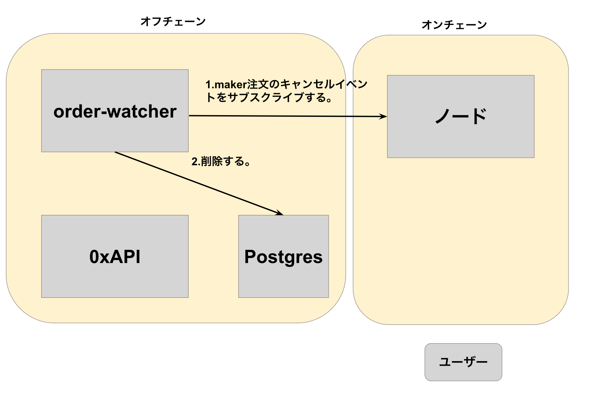
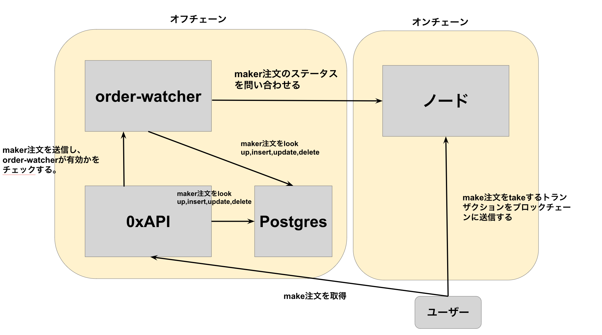

# Order-watcher

## 全体構成図

order-watcher はハイブリッド板取引アプリケーションのサービスの一部です。

ハイブリッド板取引

-   off-chain
    -   0xAPI
    -   order-watcher
-   on-chain
    -   ZeroEx



## システムの構成要素と名称

### 名称

|                                    |                                                                                                                                                                                                                                    |
| ---------------------------------- | ---------------------------------------------------------------------------------------------------------------------------------------------------------------------------------------------------------------------------------- |
| ハイブリッド板取引アプリケーション | オフチェーンとオンチェーンのシステムからなる板取引アプリケーション                                                                                                                                                                 |
| 0xAPI                              | ハイブリッド板取引の API を提供する app                                                                                                                                                                                            |
| order-watcher                      | 0xAPI の Postgres のに対して CRUD 処理を行う app                                                                                                                                                                                   |
| ノード                             | ここではブロックチェーンのノードを指す                                                                                                                                                                                             |
| make 注文(maker 注文)              | 0xAPI で用いられる指値注文に似た形式の注文                                                                                                                                                                                         |
| take 注文(taker 注文)              | make 注文を約定する注文,成行注文に似た注文                                                                                                                                                                                         |
| maker                              | make 注文を実行するユーザーのことを指す. 同一ユーザーでも maker になったり、taker になったりする。                                                                                                                                 |
| taker                              | take 注文を実行するユーザーのことを指す                                                                                                                                                                                            |
| 板                                 | ここでは、板は make 注文が売りと買いでソートされたものを指す                                                                                                                                                                       |
| 完全約定                           |                                                                                                                                                                                                                                    |
| 部分約定                           |                                                                                                                                                                                                                                    |
| ZeroEx                             | ハイブリッド板取引 app のオンチェーン部分のシステム(Solidity で書かれたコントラクト)。1.maker と taker 間でトークンの転送を行い、注文を約定させる。2.make 注文のステータスを格納し、オフチェーン側から問い合わせる機能を提供する。 |
| ExchangeProxy                      | ZeroEx のことを指す                                                                                                                                                                                                                      |

make,take 注文は指値注文に対応するが、一般的な取引所で提供される注文とは仕様が異なる。

#### make 注文について

-   指値注文に似た注文(0x 公式 doc では指値注文と呼んでいる)
-   [データ形式](https://docs.0x.org/limit-orders-advanced-traders/docs/limit-order-structure)
    -   例えば、make 注文は xxx というタイムスタンプまでに tokenA を 10.0 売って、tokenB を 20 買っても良い、という注文形式をとる。

#### make 注文の有効性の定義

maker 注文は無効になる場合がある。

有効の定義: 次の条件を全て満たす maker 注文は有効である。

-   注文の有効期限が切れていない
-   maker が売るトークンの数量を保有している。ZeroEx に対してトークン転送を許可している。(approval)
-   キャンセルされていない
-   完全約定されていない
-   maker が maker 注文に施した署名が有効である

#### take 注文について

-   make 注文を約定させる注文

    -   例えば xxx というタイムスタンプまでに tokenA を 10.0 売って、tokenB を 20 買っても良い、という make 注文があったとする。

        別のユーザー B がこの注文内容に合意したら、ブロックチェーン上でトークンの取引を行い、ユーザー B は tokenA を 10.0 買取り、代わりに tokenB を支払う。
        これをユーザー B が make 注文を「約定した」という。特にこの場合、販売数量の 100%が取引成立しているので「完全約定」と呼ぶ。
        もし、ユーザー B が tokenA 5.0 を買い,tokenB を 10 売ったなら、販売数量の 50%のみが約定しているので「部分約定」と呼ぶ。

## ユーザーフロー

## 機能分割

### 0xAPI

-   ユーザーに対して板取引に関する API を提供する
    詳細:[Reference](https://docs.0x.org/0x-api-orderbook/api-references)
    1.  maker 注文を取得できる API
    2.  板を取得できる API
    3.  ユーザーが注文を提出できる API
        -   order-watcher へ注文を送信する。order-watcher は受け取った注文の有効性を検証した後、Postgres へ格納する。

### Postgres

-   ユーザーが提出した**有効な** maker 注文のみを格納するべき

[スキーマ:`SignedOrderV4Entity`](../../src/entities/SignedOrderV4Entity.ts)

```ts
    @PrimaryColumn({ name: 'hash' })
    public hash?: string;

    @ViewColumn({ name: 'maker_token' })
    public makerToken?: string;

    @ViewColumn({ name: 'taker_token' })
    public takerToken?: string;

    @ViewColumn({ name: 'maker_amount' })
    public makerAmount?: string;

    @ViewColumn({ name: 'taker_amount' })
    public takerAmount?: string;

    @ViewColumn()
    public maker?: string;

    @ViewColumn()
    public taker?: string;

    @ViewColumn()
    public pool?: string;

    @ViewColumn()
    public expiry?: string;

    @ViewColumn()
    public salt?: string;

    @ViewColumn({ name: 'verifying_contract' })
    public verifyingContract?: string;

    @ViewColumn({ name: 'taker_token_fee_amount' })
    public takerTokenFeeAmount?: string;

    @ViewColumn()
    public sender?: string;

    @ViewColumn({ name: 'fee_recipient' })
    public feeRecipient?: string;

    @ViewColumn()
    public signature?: string;

    @ViewColumn({ name: 'remaining_fillable_taker_amount' })
    public remainingFillableTakerAmount?: string;

    @ViewColumn({ name: 'created_at' })
    public createdAt?: string;
```

### order-watcher

1.  0xAPI から受け取った make 注文の有効性を検証し、Postgres に格納する。

    

2.  Postgres 内の注文を有効な注文のみに保つ。

    -   無効な注文を削除する。
        -   一定時間間隔で DB 内の全 maker 注文の有効性を ZeroEx へ問い合わせる。無効なら削除する。
        -   チェーン上の注文のキャンセルイベントをサブスクライブして、キャンセルされた注文は DB から削除する。

    

    -   有効な注文を最新の状態に同期する。
        -   一定時間間隔で DB 内の全 maker 注文の約定可能残量を問い合わせる。DB 内の各 maker 注文メタデータの約定可能残量(`remainingTakerFillableAmount`)を部分約定した分だけ少なくして更新する。

    

## References

ZeroEx https://protocol.0x.org/en/latest/architecture/overview.html

0xAPI https://docs.0x.org/0x-api-orderbook/api-references
